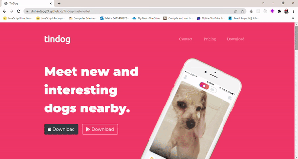

<h1 align="center">Tindog Site</h1>

* It's a beautiful startup landing page built using Bootstrap and more advanced CSS.
* It contains a title section, as well as features section, a carousel to browse testimonials, a pricing plan section, and a download app section, and finally a little footer with socials.

<br>

<p align="center">
  
<br >
<br/>

</p>

## Getting Started

Start by cloning the repo : 
```sh
git clone https://github.com/dishantagg24/Tindog-master-site.git
```
Or Download and extract the zip file.
### Prerequisites

* A modern-web browser like Brave , Chrome , Firefox etc
* Computer..

### Running

1. Double-Click on index.html file or Open it with your favourite browser.

## Built With

* [HTML](https://www.html.com/) - Standard markup language
* [CSS](https://css.com) - Style sheet language
* [Bootstrap](https://getbootstrap.com/) - CSS framework

## Authors

* **[Dishant Aggarwal](https://github.com/dishantagg24)**
